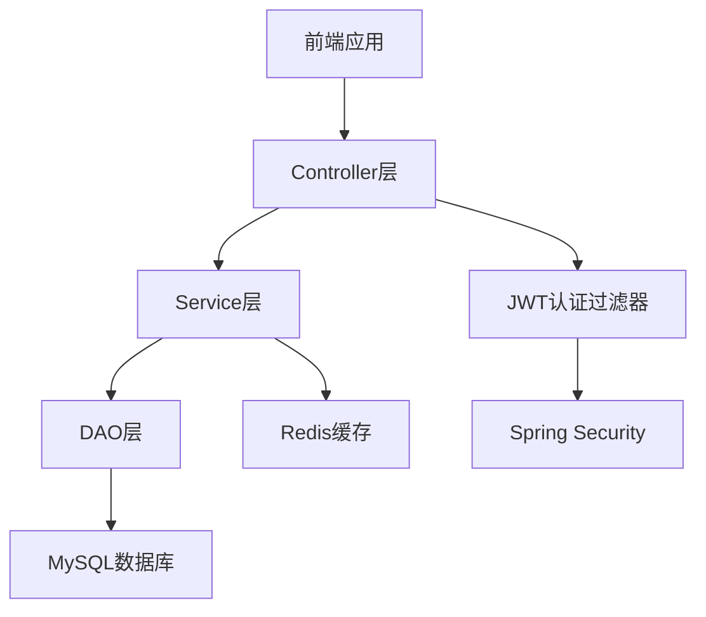

# 设计文档

## 概述

外卖/电商管理系统采用经典的三层架构设计，基于Spring Boot框架构建，集成MyBatis-Plus作为ORM框架，Redis作为缓存层，JWT实现无状态认证。系统严格遵循分层设计原则，通过DTO、VO、POJO的明确职责划分，确保代码的可维护性和扩展性。

## 架构

### 整体架构



### 分层架构设计

**表现层 (Controller Layer)**
- 处理HTTP请求和响应
- 参数验证和数据转换
- 调用Service层业务逻辑
- 返回VO对象给前端

**业务层 (Service Layer)**
- 实现核心业务逻辑
- 事务管理和数据一致性
- 缓存策略实现
- DTO对象间的转换

**数据访问层 (DAO Layer)**
- 数据库CRUD操作
- MyBatis-Plus集成
- 数据持久化管理
- POJO与数据库映射

**缓存层 (Cache Layer)**
- Redis缓存管理
- 热点数据缓存
- 缓存更新策略
- 缓存穿透防护

## 组件和接口

### 核心组件

**1. 用户认证组件**
```java
// JWT工具类
public class JwtUtil {
    public String generateToken(UserDetails userDetails);
    public Boolean validateToken(String token, UserDetails userDetails);
    public String getUsernameFromToken(String token);
}

// 认证过滤器
public class JwtAuthenticationFilter extends OncePerRequestFilter {
    protected void doFilterInternal(HttpServletRequest request, 
                                  HttpServletResponse response, 
                                  FilterChain chain);
}
```

**2. 缓存管理组件**
```java
// Redis缓存服务
public interface CacheService {
    void set(String key, Object value, long timeout);
    Object get(String key);
    void delete(String key);
    void deletePattern(String pattern);
}

// 缓存配置
@Configuration
public class RedisConfig {
    @Bean
    public RedisTemplate<String, Object> redisTemplate();
    @Bean
    public CacheManager cacheManager();
}
```

**3. 权限控制组件**
```java
// 安全配置
@Configuration
@EnableWebSecurity
public class SecurityConfig {
    @Bean
    public SecurityFilterChain filterChain(HttpSecurity http);
    @Bean
    public PasswordEncoder passwordEncoder();
}
```

### 接口设计

**用户管理接口**
```java
@RestController
@RequestMapping("/api/users")
public class UserController {
    @PostMapping("/register")
    public ResponseEntity<ApiResponse> register(@RequestBody UserRegisterDTO dto);
    
    @PostMapping("/login")
    public ResponseEntity<LoginResponseVO> login(@RequestBody UserLoginDTO dto);
    
    @GetMapping("/profile")
    public ResponseEntity<UserProfileVO> getProfile();
}
```

**商品管理接口**
```java
@RestController
@RequestMapping("/api/products")
public class ProductController {
    @GetMapping
    public ResponseEntity<PageResult<ProductVO>> getProducts(@RequestParam ProductQueryDTO dto);
    
    @GetMapping("/{id}")
    public ResponseEntity<ProductDetailVO> getProductDetail(@PathVariable Long id);
    
    @GetMapping("/search")
    public ResponseEntity<List<ProductVO>> searchProducts(@RequestParam String keyword);
}
```

**购物车接口**
```java
@RestController
@RequestMapping("/api/cart")
public class CartController {
    @PostMapping("/add")
    public ResponseEntity<ApiResponse> addToCart(@RequestBody CartItemDTO dto);
    
    @GetMapping
    public ResponseEntity<CartVO> getCart();
    
    @PutMapping("/update")
    public ResponseEntity<ApiResponse> updateCartItem(@RequestBody CartUpdateDTO dto);
    
    @DeleteMapping("/{itemId}")
    public ResponseEntity<ApiResponse> removeFromCart(@PathVariable Long itemId);
}
```

**订单管理接口**
```java
@RestController
@RequestMapping("/api/orders")
public class OrderController {
    @PostMapping
    public ResponseEntity<OrderVO> createOrder(@RequestBody OrderCreateDTO dto);
    
    @GetMapping
    public ResponseEntity<PageResult<OrderVO>> getOrders(@RequestParam OrderQueryDTO dto);
    
    @GetMapping("/{id}")
    public ResponseEntity<OrderDetailVO> getOrderDetail(@PathVariable Long id);
}
```

## 数据模型

### 实体类设计

**用户实体 (POJO)**
```java
@TableName("users")
public class User {
    @TableId(type = IdType.AUTO)
    private Long id;
    private String username;
    private String password;
    private String email;
    private String phone;
    private Integer role; // 0-普通用户, 1-管理员
    private LocalDateTime createTime;
    private LocalDateTime updateTime;
}
```

**商品实体 (POJO)**
```java
@TableName("products")
public class Product {
    @TableId(type = IdType.AUTO)
    private Long id;
    private String name;
    private String description;
    private BigDecimal price;
    private Integer stock;
    private Long categoryId;
    private String imageUrl;
    private Integer status; // 0-下架, 1-上架
    private LocalDateTime createTime;
    private LocalDateTime updateTime;
}
```

**订单实体 (POJO)**
```java
@TableName("orders")
public class Order {
    @TableId(type = IdType.AUTO)
    private Long id;
    private String orderNo;
    private Long userId;
    private BigDecimal totalAmount;
    private Integer status; // 0-待支付, 1-已支付, 2-已发货, 3-已完成, 4-已取消
    private String address;
    private LocalDateTime createTime;
    private LocalDateTime updateTime;
}
```

### DTO设计 (数据传输对象)

**用户注册DTO**
```java
public class UserRegisterDTO {
    @NotBlank(message = "用户名不能为空")
    private String username;
    
    @NotBlank(message = "密码不能为空")
    @Size(min = 6, message = "密码长度不能少于6位")
    private String password;
    
    @Email(message = "邮箱格式不正确")
    private String email;
    
    @Pattern(regexp = "^1[3-9]\\d{9}$", message = "手机号格式不正确")
    private String phone;
}
```

**商品查询DTO**
```java
public class ProductQueryDTO {
    private Long categoryId;
    private String keyword;
    private BigDecimal minPrice;
    private BigDecimal maxPrice;
    private Integer page = 1;
    private Integer size = 10;
    private String sortBy = "createTime";
    private String sortOrder = "desc";
}
```

### VO设计 (视图对象)

**用户信息VO**
```java
public class UserProfileVO {
    private Long id;
    private String username;
    private String email;
    private String phone;
    private String roleName;
    private String createTime;
}
```

**商品详情VO**
```java
public class ProductDetailVO {
    private Long id;
    private String name;
    private String description;
    private String price;
    private Integer stock;
    private String categoryName;
    private String imageUrl;
    private Boolean inStock;
    private String createTime;
}
```

### 数据库表设计

```sql
-- 用户表
CREATE TABLE users (
    id BIGINT AUTO_INCREMENT PRIMARY KEY,
    username VARCHAR(50) UNIQUE NOT NULL,
    password VARCHAR(100) NOT NULL,
    email VARCHAR(100),
    phone VARCHAR(20),
    role TINYINT DEFAULT 0,
    create_time DATETIME DEFAULT CURRENT_TIMESTAMP,
    update_time DATETIME DEFAULT CURRENT_TIMESTAMP ON UPDATE CURRENT_TIMESTAMP
);

-- 商品分类表
CREATE TABLE categories (
    id BIGINT AUTO_INCREMENT PRIMARY KEY,
    name VARCHAR(50) NOT NULL,
    description TEXT,
    sort_order INT DEFAULT 0,
    create_time DATETIME DEFAULT CURRENT_TIMESTAMP
);

-- 商品表
CREATE TABLE products (
    id BIGINT AUTO_INCREMENT PRIMARY KEY,
    name VARCHAR(100) NOT NULL,
    description TEXT,
    price DECIMAL(10,2) NOT NULL,
    stock INT DEFAULT 0,
    category_id BIGINT,
    image_url VARCHAR(255),
    status TINYINT DEFAULT 1,
    create_time DATETIME DEFAULT CURRENT_TIMESTAMP,
    update_time DATETIME DEFAULT CURRENT_TIMESTAMP ON UPDATE CURRENT_TIMESTAMP,
    FOREIGN KEY (category_id) REFERENCES categories(id)
);

-- 购物车表
CREATE TABLE cart_items (
    id BIGINT AUTO_INCREMENT PRIMARY KEY,
    user_id BIGINT NOT NULL,
    product_id BIGINT NOT NULL,
    quantity INT NOT NULL,
    create_time DATETIME DEFAULT CURRENT_TIMESTAMP,
    update_time DATETIME DEFAULT CURRENT_TIMESTAMP ON UPDATE CURRENT_TIMESTAMP,
    FOREIGN KEY (user_id) REFERENCES users(id),
    FOREIGN KEY (product_id) REFERENCES products(id),
    UNIQUE KEY uk_user_product (user_id, product_id)
);

-- 订单表
CREATE TABLE orders (
    id BIGINT AUTO_INCREMENT PRIMARY KEY,
    order_no VARCHAR(32) UNIQUE NOT NULL,
    user_id BIGINT NOT NULL,
    total_amount DECIMAL(10,2) NOT NULL,
    status TINYINT DEFAULT 0,
    address TEXT,
    create_time DATETIME DEFAULT CURRENT_TIMESTAMP,
    update_time DATETIME DEFAULT CURRENT_TIMESTAMP ON UPDATE CURRENT_TIMESTAMP,
    FOREIGN KEY (user_id) REFERENCES users(id)
);

-- 订单详情表
CREATE TABLE order_items (
    id BIGINT AUTO_INCREMENT PRIMARY KEY,
    order_id BIGINT NOT NULL,
    product_id BIGINT NOT NULL,
    product_name VARCHAR(100) NOT NULL,
    product_price DECIMAL(10,2) NOT NULL,
    quantity INT NOT NULL,
    FOREIGN KEY (order_id) REFERENCES orders(id),
    FOREIGN KEY (product_id) REFERENCES products(id)
);
```

## 正确性属性

*属性是一个特征或行为，应该在系统的所有有效执行中保持为真——本质上是关于系统应该做什么的正式声明。属性作为人类可读规范和机器可验证正确性保证之间的桥梁。*

### 属性 1: 用户注册一致性
*对于任何*有效的用户注册信息，注册成功后应该能够使用相同的凭据成功登录
**验证需求: 需求 1.1, 1.2**

### 属性 2: JWT令牌认证有效性
*对于任何*有效的JWT令牌，访问需要认证的接口应该成功；对于任何无效或过期的JWT令牌，访问应该被拒绝
**验证需求: 需求 1.3, 1.4, 7.1**

### 属性 3: 登出令牌失效
*对于任何*用户，登出操作后其JWT令牌应该立即失效，无法再用于访问受保护资源
**验证需求: 需求 1.5**

### 属性 4: 商品搜索准确性
*对于任何*搜索关键词，返回的商品列表中的每个商品都应该包含该关键词（在名称或描述中）
**验证需求: 需求 2.2**

### 属性 5: 商品缓存一致性
*对于任何*商品，当商品信息被更新时，数据库和Redis缓存中的数据应该保持一致
**验证需求: 需求 2.4, 6.2, 6.3**

### 属性 6: 缓存优先读取
*对于任何*商品分类或商品详情请求，如果Redis缓存中存在数据，系统应该优先从缓存获取而不是查询数据库
**验证需求: 需求 2.5, 6.1**

### 属性 7: 购物车操作一致性
*对于任何*用户的购物车操作（添加、修改、删除），操作后的购物车状态应该准确反映所有变更
**验证需求: 需求 3.1, 3.2, 3.3**

### 属性 8: 购物车总价计算正确性
*对于任何*购物车，显示的总价应该等于所有商品的（单价 × 数量）之和
**验证需求: 需求 3.4**

### 属性 9: 购物车清空完整性
*对于任何*用户，清空购物车操作后，购物车应该不包含任何商品项
**验证需求: 需求 3.5**

### 属性 10: 订单创建完整性
*对于任何*从购物车创建的订单，订单应该包含购物车中的所有商品信息，且创建成功后购物车应该被清空
**验证需求: 需求 4.1, 4.2**

### 属性 11: 订单查询准确性
*对于任何*用户，查询订单历史应该返回该用户的所有订单，且订单详情应该包含完整的商品和状态信息
**验证需求: 需求 4.3, 4.4**

### 属性 12: 订单状态更新一致性
*对于任何*订单，管理员更新订单状态后，订单的状态应该立即反映在所有查询中
**验证需求: 需求 4.5**

### 属性 13: 权限控制严格性
*对于任何*用户角色，只有具有相应权限的用户才能访问对应的功能接口，普通用户不能访问管理员功能
**验证需求: 需求 5.1, 7.2, 7.3, 7.4**

### 属性 14: 商品管理缓存同步
*对于任何*商品管理操作（添加、修改、删除），数据库变更应该同步反映到Redis缓存中
**验证需求: 需求 5.2, 5.3, 5.4**

### 属性 15: 缓存过期重新加载
*对于任何*过期的缓存数据，系统应该自动从数据库重新加载最新数据并更新缓存
**验证需求: 需求 6.4**

## 错误处理

### 异常处理策略

**全局异常处理器**
```java
@RestControllerAdvice
public class GlobalExceptionHandler {
    
    @ExceptionHandler(ValidationException.class)
    public ResponseEntity<ApiResponse> handleValidation(ValidationException e) {
        return ResponseEntity.badRequest()
            .body(ApiResponse.error("参数验证失败: " + e.getMessage()));
    }
    
    @ExceptionHandler(AuthenticationException.class)
    public ResponseEntity<ApiResponse> handleAuth(AuthenticationException e) {
        return ResponseEntity.status(HttpStatus.UNAUTHORIZED)
            .body(ApiResponse.error("认证失败: " + e.getMessage()));
    }
    
    @ExceptionHandler(AccessDeniedException.class)
    public ResponseEntity<ApiResponse> handleAccess(AccessDeniedException e) {
        return ResponseEntity.status(HttpStatus.FORBIDDEN)
            .body(ApiResponse.error("权限不足"));
    }
    
    @ExceptionHandler(BusinessException.class)
    public ResponseEntity<ApiResponse> handleBusiness(BusinessException e) {
        return ResponseEntity.badRequest()
            .body(ApiResponse.error(e.getMessage()));
    }
    
    @ExceptionHandler(Exception.class)
    public ResponseEntity<ApiResponse> handleGeneral(Exception e) {
        log.error("系统异常", e);
        return ResponseEntity.status(HttpStatus.INTERNAL_SERVER_ERROR)
            .body(ApiResponse.error("系统繁忙，请稍后重试"));
    }
}
```

**业务异常定义**
```java
public class BusinessException extends RuntimeException {
    private String code;
    private String message;
    
    public BusinessException(String message) {
        super(message);
        this.message = message;
    }
    
    public BusinessException(String code, String message) {
        super(message);
        this.code = code;
        this.message = message;
    }
}

// 具体业务异常
public class UserNotFoundException extends BusinessException {
    public UserNotFoundException() {
        super("USER_NOT_FOUND", "用户不存在");
    }
}

public class ProductOutOfStockException extends BusinessException {
    public ProductOutOfStockException() {
        super("PRODUCT_OUT_OF_STOCK", "商品库存不足");
    }
}

public class InvalidTokenException extends BusinessException {
    public InvalidTokenException() {
        super("INVALID_TOKEN", "令牌无效或已过期");
    }
}
```

### 缓存异常处理

**Redis连接异常处理**
```java
@Service
public class CacheServiceImpl implements CacheService {
    
    @Override
    public Object get(String key) {
        try {
            return redisTemplate.opsForValue().get(key);
        } catch (Exception e) {
            log.warn("Redis获取数据失败，key: {}, 错误: {}", key, e.getMessage());
            return null; // 缓存失败时返回null，由业务层从数据库获取
        }
    }
    
    @Override
    public void set(String key, Object value, long timeout) {
        try {
            redisTemplate.opsForValue().set(key, value, timeout, TimeUnit.SECONDS);
        } catch (Exception e) {
            log.warn("Redis设置数据失败，key: {}, 错误: {}", key, e.getMessage());
            // 缓存设置失败不影响业务流程
        }
    }
}
```

### 数据库异常处理

**事务回滚策略**
```java
@Service
@Transactional(rollbackFor = Exception.class)
public class OrderServiceImpl implements OrderService {
    
    @Override
    public OrderVO createOrder(OrderCreateDTO dto) {
        try {
            // 1. 验证购物车
            List<CartItem> cartItems = cartService.getCartItems(dto.getUserId());
            if (cartItems.isEmpty()) {
                throw new BusinessException("购物车为空，无法创建订单");
            }
            
            // 2. 检查库存
            for (CartItem item : cartItems) {
                Product product = productService.getById(item.getProductId());
                if (product.getStock() < item.getQuantity()) {
                    throw new ProductOutOfStockException();
                }
            }
            
            // 3. 创建订单
            Order order = createOrderFromCart(cartItems, dto);
            orderMapper.insert(order);
            
            // 4. 减少库存
            updateProductStock(cartItems);
            
            // 5. 清空购物车
            cartService.clearCart(dto.getUserId());
            
            return convertToVO(order);
            
        } catch (BusinessException e) {
            throw e; // 业务异常直接抛出
        } catch (Exception e) {
            log.error("创建订单失败", e);
            throw new BusinessException("订单创建失败，请重试");
        }
    }
}
```

## 测试策略

### 双重测试方法

**单元测试**
- 验证具体示例、边界情况和错误条件
- 测试各层组件的独立功能
- 使用Mock对象隔离依赖
- 重点测试业务逻辑和数据转换

**属性测试**
- 验证跨所有输入的通用属性
- 通过随机化实现全面的输入覆盖
- 每个属性测试最少运行100次迭代
- 测试系统的不变量和一致性

### 属性测试配置

**测试框架选择**: JUnit 5 + QuickTheories (Java属性测试库)

**属性测试示例**
```java
@Test
@DisplayName("Feature: ecommerce-management-system, Property 1: 用户注册一致性")
public void testUserRegistrationConsistency() {
    qt().forAll(
        userRegistrationDTOs(),
        validPasswords()
    ).check((registerDTO, password) -> {
        // 注册用户
        ApiResponse registerResponse = userService.register(registerDTO);
        assumeThat(registerResponse.isSuccess()).isTrue();
        
        // 使用相同凭据登录
        UserLoginDTO loginDTO = new UserLoginDTO();
        loginDTO.setUsername(registerDTO.getUsername());
        loginDTO.setPassword(password);
        
        LoginResponseVO loginResponse = userService.login(loginDTO);
        
        return loginResponse != null && 
               loginResponse.getToken() != null &&
               !loginResponse.getToken().isEmpty();
    });
}

@Test
@DisplayName("Feature: ecommerce-management-system, Property 8: 购物车总价计算正确性")
public void testCartTotalPriceCalculation() {
    qt().forAll(
        users(),
        lists().of(cartItems()).ofSizeBetween(1, 10)
    ).check((user, items) -> {
        // 清空购物车
        cartService.clearCart(user.getId());
        
        // 添加商品到购物车
        BigDecimal expectedTotal = BigDecimal.ZERO;
        for (CartItemDTO item : items) {
            cartService.addToCart(user.getId(), item);
            Product product = productService.getById(item.getProductId());
            expectedTotal = expectedTotal.add(
                product.getPrice().multiply(BigDecimal.valueOf(item.getQuantity()))
            );
        }
        
        // 获取购物车
        CartVO cart = cartService.getCart(user.getId());
        
        return cart.getTotalAmount().compareTo(expectedTotal) == 0;
    });
}
```

**数据生成器**
```java
public class TestDataGenerators {
    
    public static Gen<UserRegisterDTO> userRegistrationDTOs() {
        return Gen.combine(
            strings().allPossible().ofLengthBetween(3, 20),
            strings().allPossible().ofLengthBetween(6, 20),
            emails(),
            phoneNumbers()
        ).as(UserRegisterDTO::new);
    }
    
    public static Gen<String> emails() {
        return Gen.combine(
            strings().ascii().ofLengthBetween(3, 10),
            strings().of("gmail.com", "163.com", "qq.com")
        ).as((name, domain) -> name + "@" + domain);
    }
    
    public static Gen<CartItemDTO> cartItems() {
        return Gen.combine(
            longs().between(1L, 1000L), // productId
            integers().between(1, 10)   // quantity
        ).as(CartItemDTO::new);
    }
}
```

### 测试覆盖策略

**单元测试覆盖**
- Controller层: 参数验证、权限控制、响应格式
- Service层: 业务逻辑、事务处理、异常处理
- DAO层: 数据访问、SQL映射、数据转换
- 工具类: JWT处理、缓存操作、数据转换

**集成测试覆盖**
- 数据库集成: 使用TestContainers启动真实MySQL
- Redis集成: 使用嵌入式Redis进行缓存测试
- 安全集成: JWT认证和权限控制端到端测试
- API集成: 完整的HTTP请求响应流程测试

**性能测试**
- 缓存性能: 验证Redis缓存提升响应速度
- 并发测试: 模拟多用户同时操作购物车和订单
- 压力测试: 验证系统在高负载下的稳定性

### 测试数据管理

**测试数据隔离**
```java
@TestMethodOrder(OrderAnnotation.class)
@Transactional
@Rollback
public class IntegrationTest {
    
    @BeforeEach
    void setUp() {
        // 清理测试数据
        cleanupTestData();
        // 初始化基础数据
        initializeTestData();
    }
    
    @AfterEach
    void tearDown() {
        // 清理Redis缓存
        redisTemplate.getConnectionFactory()
            .getConnection().flushAll();
    }
}
```

**测试配置**
```yaml
# application-test.yml
spring:
  datasource:
    url: jdbc:h2:mem:testdb
    driver-class-name: org.h2.Driver
  redis:
    host: localhost
    port: 6370  # 测试专用Redis端口
  jpa:
    hibernate:
      ddl-auto: create-drop
    show-sql: true

logging:
  level:
    com.ecommerce: DEBUG
    org.springframework.security: DEBUG
```